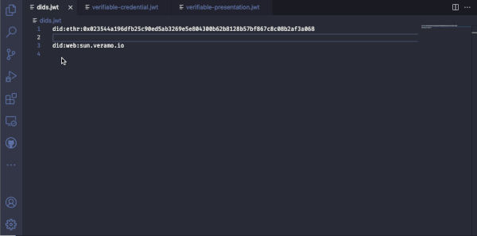
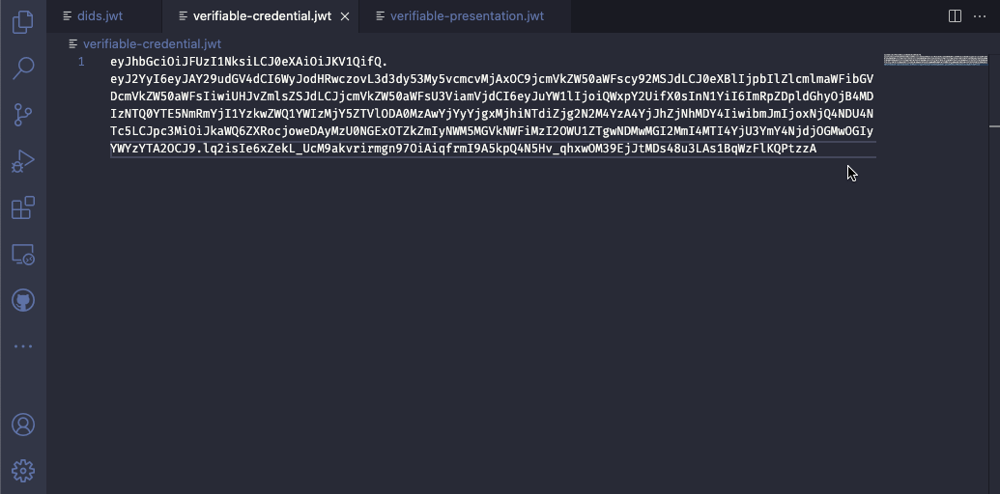

# Veramo extension for Visual Studio Code

Verifiable data management using [Veramo](https://veramo.io) framework

## Features

### Resolving a DID Document 

Select a `did` string and run `Veramo: Resolve DID` command

### Verifying W3C JWT Verifiable Credentials and Presentations

Select a `JWT` string and run `Veramo: Verify JWT` command

## Release Notes

### 0.0.5

* Rendering Verifiable Credentials using [@veramo-community/react-components](https://github.com/veramolabs/react-components) 
* Upgrade to `@veramo/*@4.2.0`
* docs: examples IIW35
* feat: hover over didUrl to get resolution result
* feat: verified status bar item
* feat: did url decorator
* feat: codeLens provider for markdown code blocks
* feat: remote instance
* feat: show did in status bar
* feat: sign credential
* feat: sign credential in a selection
* feat: sign any file and store VCs in context dir

### 0.0.4

Added ability to verify full credentials (not just the JWT part)

### 0.0.2

Added ability to preview and verify `vc+jwt` code blocks in markdown files

### 0.0.1

Initial release of Veramo extension with minimal feature set
