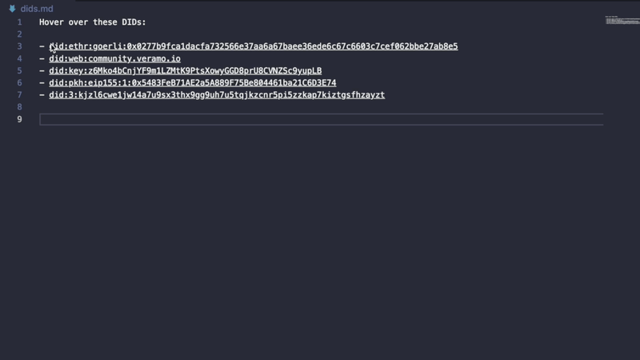
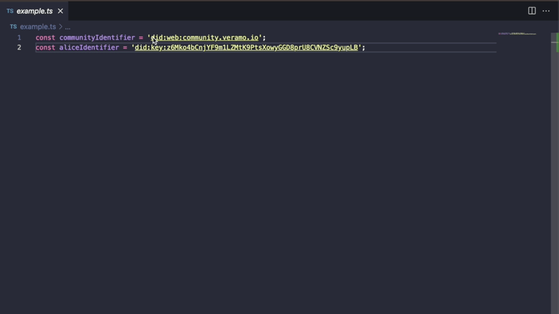
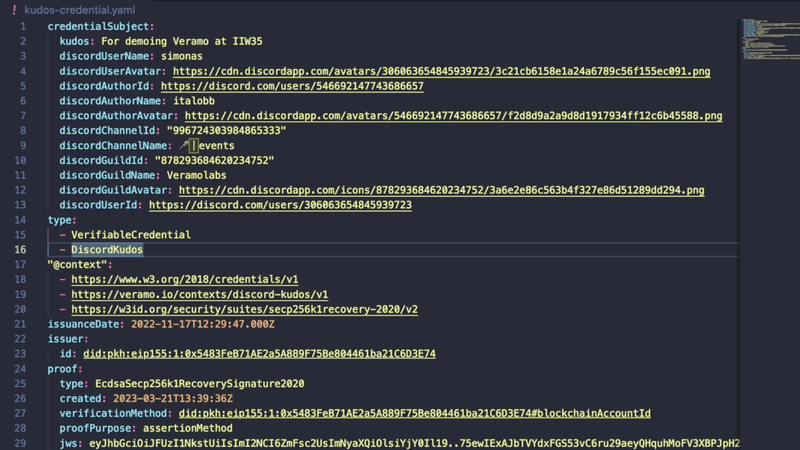
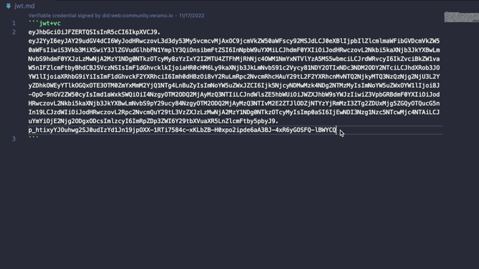
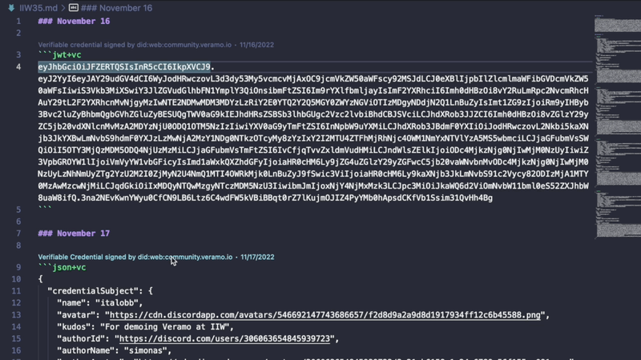
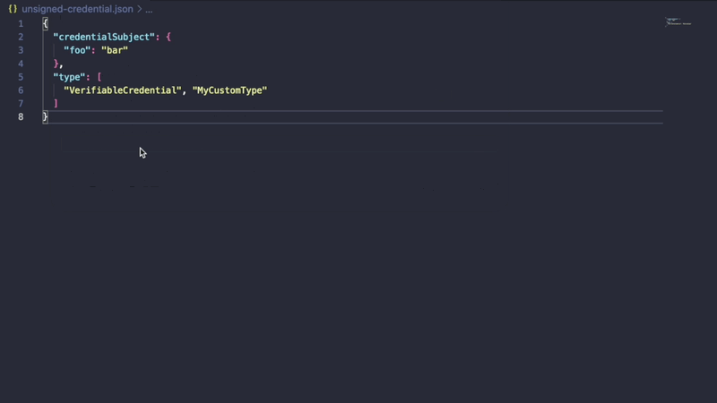
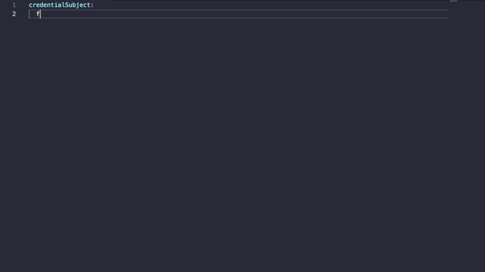

# Veramo extension for Visual Studio Code

Verifiable data management using [Veramo](https://veramo.io) framework

## Features

* Resolve DID
* Code decorator for DID URLs
* Hover popup for DID URLs
* Verify Verifiable Credentials
  - JWT
  - JSON
  - YAML
* Verify Verifiable Presentations
* Show signer DID in the status bar
* Preview Verifiable Credentials in Markdown files
* Show inline verification result preview (CodeLens) for VCreds in Markdown files
* Ability to use remote Veramo instance
* Sign Verifiable Credentials
  - as a file
  - as a selection
* Sign any file and store VCreds in a context folder
* Sign Markdown files using front matter

## Demo

[Video](https://youtu.be/TKHAxIWuSgI)

Resolve DID by hovering mouse over DID URL

Resolve DID by selecting DID URL and pressing `Cmd+Shift+P` and typing `Resolve DID`

Verify Verifiable Credential by pressing `Cmd+Shift+P` and typing `Verify credential`

Verify JWT by selecting it and pressing `Cmd+Shift+P` and typing `Verify JWT`

Preview Verifiable Credentials in Markdown file

Sign Verifiable Credential JSON

Sign Verifiable Credential YAML

Sign Markdown file using front matter
